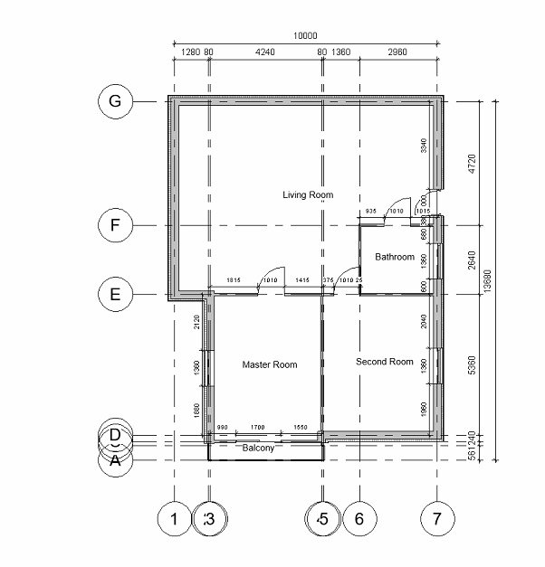
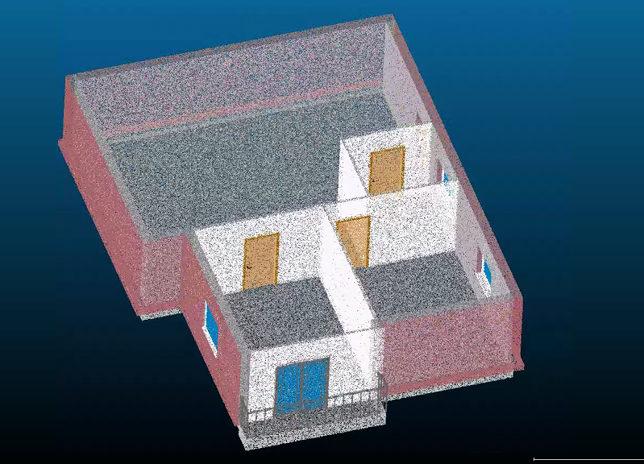

# ResBIM Dataset

This is the official repository of ResBIM Dataset.

## 1. Introduction of ResBIM dataset
Welcome to **Res**idential Unit **BIM** dataset (**ResBIM** dataset), this is a totally PUBLIC dataset.

This dataset is a part of the contributions of our paper titled <b><i>"Fully automated synthetic BIM dataset generation using a deep learning-based framework"</i></b> in *Automation in Construction*.

ResBIM is a synthetic dataset created by CNN and rule-based algorithms, designed specifically for research in BIM automation and 2D-to-BIM reconstruction. The dataset comprises 1000+ paired samples, each consisting of a fully parametric 3D BIM (RVT format) and its corresponding annotated 2D floor plan, as shown in **Figures 1, 2, and 3** at the end of texts. 

If you use the ResBIM data or code please cite our work: 

Liang, X., Yabuki, N., & Fukuda, T. (2026). Fully automated synthetic BIM dataset generation using a deep learning-based framework. Automation in Construction, 181, 106584. https://doi.org/10.1016/j.autcon.2025.106584

## 2. Tutorial: How to create your own dataset by using the source codes
Because ResBIM is a public dataset, so everyone can download and use it. And you can develop **new models** or even **new methodology** based on the source codes. 


## 3. Usage of ResBIM dataset
ResBIM is intended for a wide range of applications, including multi-platform BIM interoperability, serving as a foundation for benchmarking 2D-to-BIM algorithms, and the development of computer vision models for architectural analysis. The dataset supports a wide range of use cases, including but not limited to the following:

- 2D-to-BIM evaluation and benchmarking support. These pairs enable not only training of advanced AI models but also reproducible evaluation of 2D-to-BIM algorithms using metrics reliant on RF BIMs. 
- Obtaining various types of 2D drawings. Because BIMs are semantically rich 3D representations, all BIMs in the dataset can be converted into various 2D views such as floor plans, elevations, and cross-sections. This also addresses a common limitation highlighted in previous studies: the lack of annotated elevation drawings with height information, which has largely restricted 2D-to-BIM data extraction to planar geometry instead of multi-view representations.
- Conversion to point cloud. As shown in **Figure. 3**. Every BIM model could be converted to a point cloud with RGB, which can support point cloud studies. 

**(Notice)** In the full size dataset, there are several **failure cases** in the dataset as mentioned in the paper (e.g., 313 no openings, 732 inserted out of the range, 327 collision). **Please be careful when you are using it**. 

## 4. ResBIM dataset download 
- [One data sample](https://drive.google.com/file/d/1gh4TiEJGkcjuqtO2e13mVQOYxWl5oGbI/view?usp=drive_link)

- [100 models (700M)](https://drive.google.com/file/d/1WvWMU4Ox459QXr1kYLfTqaMp2rR0mfpO/view?usp=drive_link)

- [Full size dataset (7GB, 1000+ models)](https://drive.google.com/file/d/1MzY92Xw0bOjCWDHMJtWjqYzZew_MOhUS/view?usp=drive_link)

## 5. Source codes (400M)　
[Source codes](https://drive.google.com/file/d/1KBy_ff7xQid32mTbLn__uJ6SuPaWu3vL/view?usp=drive_link) include C#-based Revit Add-Ins and python-based networks. 

To get started　　
- Download the source code and there is a **readme.pdf**.
- The structure and the usage of each coding are introduced in the file.

## Citation （BibTeX）
```
@article{LIANG2026106584,
title = {Fully automated synthetic BIM dataset generation using a deep learning-based framework},
journal = {Automation in Construction},
volume = {181},
pages = {106584},
year = {2026},
issn = {0926-5805},
doi = {https://doi.org/10.1016/j.autcon.2025.106584},
url = {https://www.sciencedirect.com/science/article/pii/S0926580525006247},
author = {Xing Liang and Nobuyoshi Yabuki and Tomohiro Fukuda},
```

## License
This project is licensed under the [MIT License](./LICENSE) - see the LICENSE file for details.

## Figures

<h1 align="center">
  
</h1>
<h1 align="center"><b>Figure 1.</b> BIM in ResBIM dataset</h1>

<h1 align="center">
  
</h1>
<h1 align="center"><b>Figure 2.</b> Corresponding annotated floor plan</h1>

<h1 align="center">
  
</h1>
<h1 align="center"><b>Figure 3.</b> Corresponding RGB point cloud</h1>

